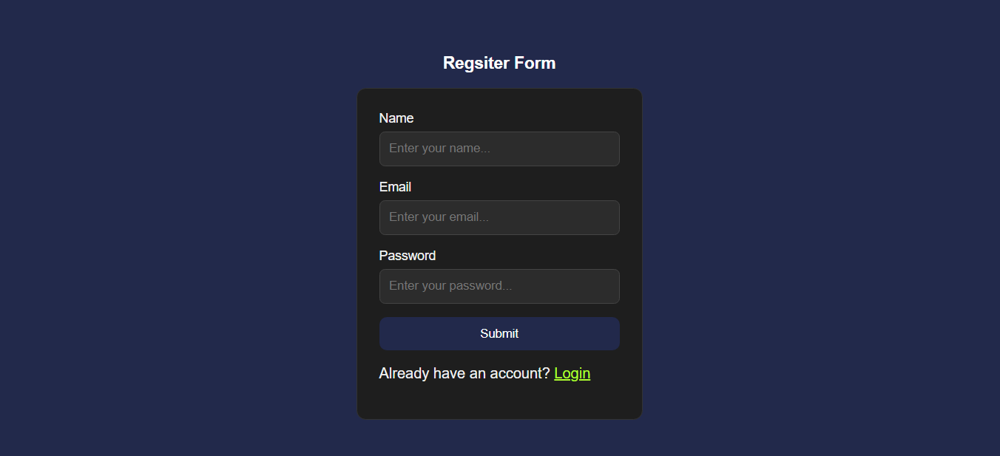
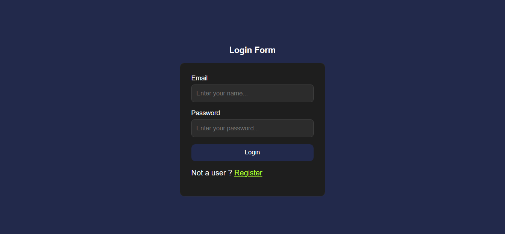
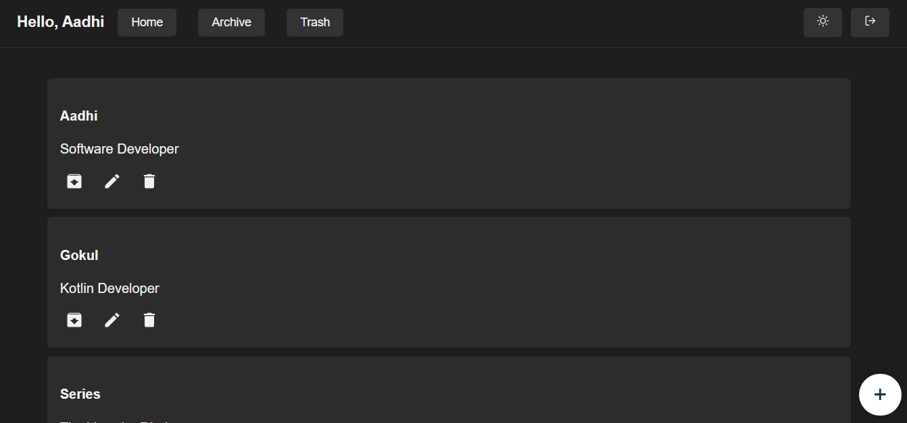
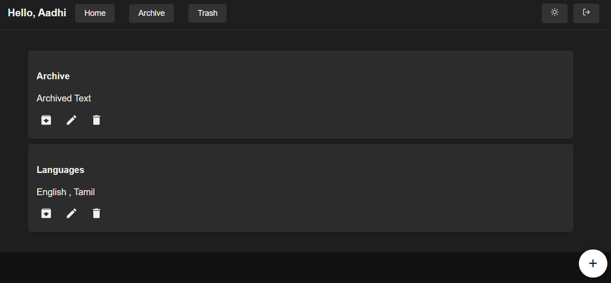
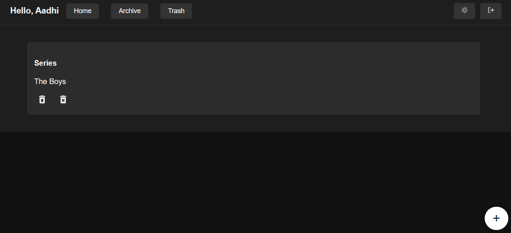
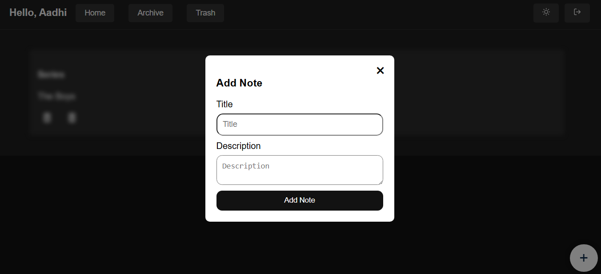
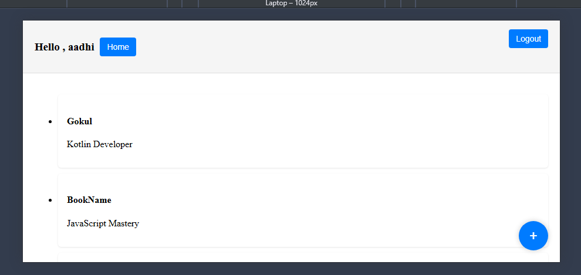

# Standard Notes Lite

A simplified, lightweight note-taking web application inspired by Standard Notes.  
This app allows users to **create**, **edit**, **archive**, **unarchive**, **trash**, **restore**, and **permanently delete** notes.  
Built with **React**, **React Router**, and a backend API for persistent storage.

---

## Features

- **User Authentication** – Register and login with secure credentials.
- **Create Notes** – Add new notes with a title and content.
- **Archive/Unarchive Notes** – Organize inactive notes into archive and restore when needed.
- **Trash/Restore/Permanent Delete** – Move unwanted notes to trash, restore them, or delete forever.
- **Theme Toggle** – Switch between light and dark modes.
- **Responsive Design** – Works on desktop, tablet, and mobile devices.

---

## Demo

A quick walkthrough of the application showcasing all key features:  
🎥 **[Watch the Demo Video](https://drive.google.com/file/d/1QQrlaqbttaOVHaxa-wN6QX-wDkyroQ9n/view?usp=sharing)**

---

## Screenshots

### 1. Register Page

### 2. Login Page

### 3. Dashboard – Home View

### 4. Dashboard – Archive View

### 5. Dashboard – Trash View

### 6. Add Note Form

### 7. Light Theme

---

## Tech Stack

**Frontend:** React, React Router, CSS  
**Backend:** Node.js, Express.js  
**Database:** MySQL  

---

## Author

**Aadhithyan Saravanan**  
Full Stack Developer | React | Node.js | MySQL | MongoDB  
📧 Email: aadhisaravanan47@gmail.com  
🔗 LinkedIn: [https://linkedin.com/in/aadhi-developer](https://linkedin.com/in/aadhi-developer)  
💻 GitHub: [https://github.com/aadhiprince](https://github.com/aadhiprince)  
🌐 Portfolio: [https://portfolio-aadhithyan.netlify.app](https://portfolio-aadhithyan.netlify.app)
